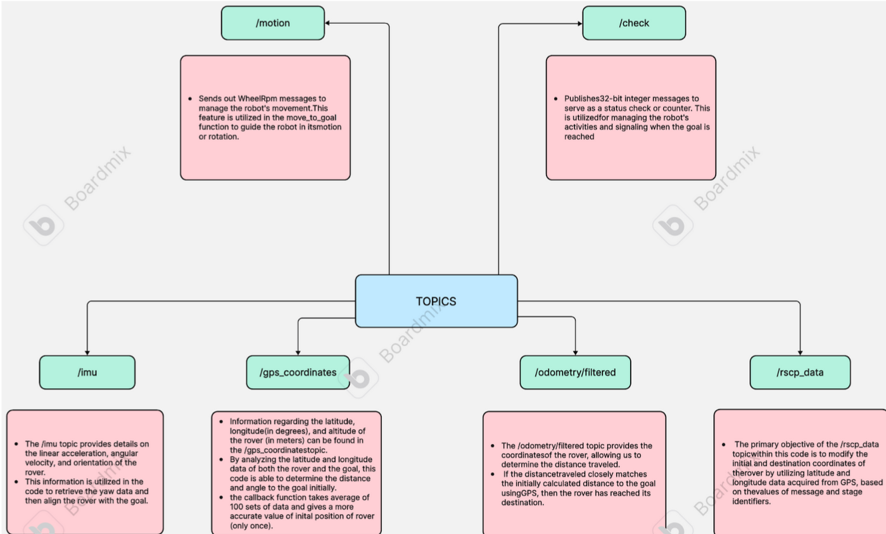

# nav2_roverH
This repository is to store documentations



Distance_to_goal:

This function uses the Haversine formula to calculate the distance between initial position and goal position.
This use GPS to get the distance only once while initiating the code.

```
def distance_to_goal(self):
    	a = math.pow(math.sin((self.goal_lat - self.initial_lat)*math.pi/360),2)+
            math.cos(self.goal_lat*math.pi/180)*math.cos(self.initial_lat*math.pi/180)*math.pow(math.sin((self.goal_long - self.initial_long)*math.pi/360),2)
    	c = 2*math.atan2(math.sqrt(a), math.sqrt(1-a))
    	print(f"a = {a}, c = {c}")
    	self.distance = 6371 * c *1000
    	self.distance_calculated = True
```

Odometer Callback function:

This function saves the initial position of rover once and then calculates the total del(x) and del(y) from the initial position.
data.pose .pose.position.x gives the total distance traveled straight ahead 
While data.pose.pose.position.y gives distance in perpendicular to straight direction(negative sign is for sensor data technicality since right of rover is required to be positive)
Self.odom_self gives delta in x and y coordinates from initial position.
```
 def odom_callback(self, data):
    	self.odom_self[0] = data.pose.pose.position.x
    	self.odom_self[1] = -data.pose.pose.position.y
    	if self.odom_initialized == False:
        	self.initial_odom[0] = self.odom_self[0]
        	self.initial_odom[1] = self.odom_self[1]
        	self.odom_initialized = True
    	self.odom_self[0] = self.odom_self[0] - self.initial_odom[0]
    	self.odom_self[1] = self.odom_self[1] - self.initial_odom[1]
```
Angle to goal function:
```
angle_req = math.atan2(self.goal_long - self.initial_long, self.goal_lat - self.initial_lat
```
Gives the angle required to face the goal 
```
if self.angle_to_turn < 0:
            rotation = "left"
            self.dummy = -1
        elif self.angle_to_turn > 0:
            rotation = "right"
            self.dummy = 1
```
Dummy is temp variable used to store direction of turn required.
-1 means rover is required to turn left
+1 means rover is required to turn right 

    	
